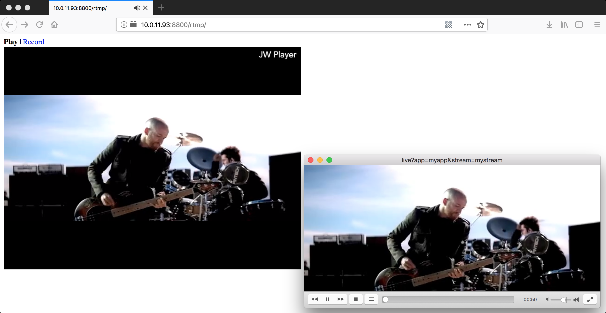
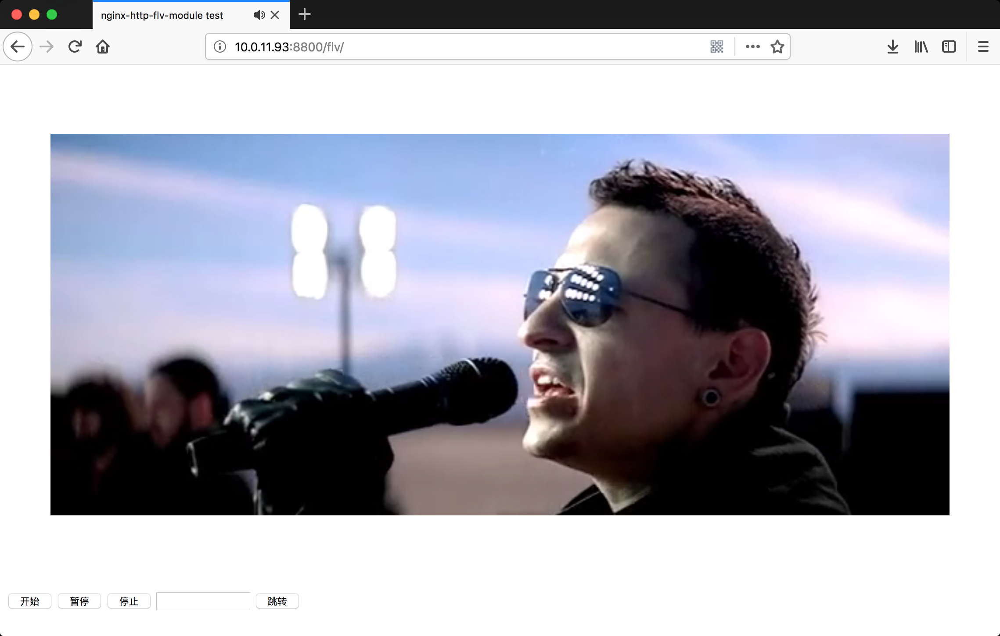

# nginx-http-flv-module

Media streaming server based on [nginx-rtmp-module](https://github.com/arut/nginx-rtmp-module).

[中文说明](https://github.com/winshining/nginx-http-flv-module/blob/master/README.CN.md).

Donate if you like this module. Many thanks to you!

### Appreciation

* Igor Sysoev, the creator of [NGINX](http://nginx.org).

* Roman Arutyunyan, who created [nginx-rtmp-module](https://github.com/arut/nginx-rtmp-module).

* Contributors, refer to [AUTHORS](https://github.com/winshining/nginx-http-flv-module/blob/master/AUTHORS) for details.

## Features

* All features [nginx-rtmp-module](https://github.com/arut/nginx-rtmp-module) provides.

* Other features provided by nginx-http-flv-module vs [nginx-rtmp-module](https://github.com/arut/nginx-rtmp-module):

|         Features        | nginx-http-flv-module | nginx-rtmp-module |                     Remarks                     |
| :---------------------: | :-------------------: | :---------------: | :---------------------------------------------: |
|   HTTP-FLV (subscribe)  |           √           |         x         |     HTTPS-FLV and chunked response supported    | 
|        GOP cache        |           √           |         x         |                                                 |
|          VHOST          |           √           |         x         |                                                 |
| Omit `listen` directive |           √           |    See remarks    |  There MUST be at least one `listen` directive  |
|   Audio-only support    |           √           |    See remarks    |  Won't work if `wait_video` or `wait_key` is on |
|  Timing log for access  |           √           |         x         |                                                 |
|     JSON style stat     |           √           |         x         |                                                 |

## Systems supported

* Linux (recommended)/FreeBSD/MacOS/Windows (limited).

## Players supported

* [VLC](http://www.videolan.org) (RTMP & HTTP-FLV)/[OBS](https://obsproject.com) (RTMP & HTTP-FLV)/[JW Player](https://www.jwplayer.com) (RTMP)/[flv.js](https://github.com/Bilibili/flv.js) (HTTP-FLV).

### Note

[flv.js](https://github.com/Bilibili/flv.js) can only run with browsers that support [Media Source Extensions](https://www.w3.org/TR/media-source).

## Prerequisites

* GNU make for activating compiler on Unix-like systems to compile software.

* GCC for compilation on Unix-like systems or MSVC for compilation on Windows.

* GDB for debug on Unix-like systems.

* [FFmpeg](http://ffmpeg.org) or [OBS](https://obsproject.com) for publishing media streams.

* [VLC](http://www.videolan.org) (recommended) or [flv.js](https://github.com/Bilibili/flv.js) (recommended) for playing media streams.

* [PCRE](http://www.pcre.org) for NGINX if regular expressions needed.

* [OpenSSL](https://www.openssl.org) for NGINX if encrypted access needed.

* [zlib](http://www.zlib.net) for NGINX if compression needed.

## Installation

### Install in RHEL/CentOS (Thanks [dvershinin](https://github.com/dvershinin))

#### RHEL/CentOS 6, 7

For these operating systems, automatic builds of the latest release of module for the latest stable NGINX are available:

    yum install https://extras.getpagespeed.com/release-el$(rpm -E %{rhel})-latest.rpm
    yum install nginx-module-flv

#### RHEL 8

    dnf install https://extras.getpagespeed.com/release-el$(rpm -E %{rhel})-latest.rpm
    sudo dnf --disablerepo=rhel-8-for-x86_64-appstream-rpms install nginx-module-flv

To enable this module, add the following to `/etc/nginx/nginx.conf` and reload NGINX:

    load_module modules/ngx_http_flv_live_module.so;

#### Note

The above setting **MUST** be located before the directive `events`, or NGINX can not be started.

Updates can be completed via `yum update`. More details about other NGINX modules, refer to [GetPageSpeed repository](https://www.getpagespeed.com/redhat).
 
For other systems, follow Installation instructions in the next section.

### Install by compiling source code

#### Note

nginx-http-flv-module has all features that [nginx-rtmp-module](https://github.com/arut/nginx-rtmp-module) provides, so **DON'T** compile nginx-http-flv-module along with [nginx-rtmp-module](https://github.com/arut/nginx-rtmp-module).

#### On Windows

For details about build steps, please refer to [Building nginx on the Win32 platform with Visual C](http://nginx.org/en/docs/howto_build_on_win32.html), and don't forget to add `--add-module=/path/to/nginx-http-flv-module` in `Run configure script` step.

#### On Unix-like systems

Download [NGINX](http://nginx.org) and nginx-http-flv-module.

Uncompress them.

cd to NGINX source directory & run this:

##### Compile the module into [NGINX](http://nginx.org)

    ./configure --add-module=/path/to/nginx-http-flv-module
    make
    make install

or

##### Compile the module as a dynamic module

    ./configure --add-dynamic-module=/path/to/nginx-http-flv-module
    make
    make install

##### Note

If the module is compiled as a dynamic module, the [NGINX](http://nginx.org) version **MUST** be equal to or greater than 1.9.11.

## Usage

For details of usages of [nginx-rtmp-module](https://github.com/arut/nginx-rtmp-module), please refer to [README.md](https://github.com/arut/nginx-rtmp-module/blob/master/README.md).

### Publish

For simplicity, transcoding is not used (so **-c copy** is used):

    ffmpeg -re -i MEDIA_FILE_NAME -c copy -f flv rtmp://example.com[:port]/appname/streamname

#### Note

* Some legacy versions of [FFmpeg](http://ffmpeg.org) don't support the option `-c copy`, the options `-vcodec copy -acodec copy` can be used instead.

The `appname` is used to match an application block in rtmp block (see below for details).

The `streamname` can be specified at will but can **NOT** be omitted.

The **default port for RTMP** is **1935**, if some other ports were used, `:port` must be specified.

### Play

#### via HTTP-FLV

    http://example.com[:port]/dir?[port=xxx&]app=appname&stream=streamname

#### Note

* If [ffplay](http://www.ffmpeg.org/ffplay.html) is used in command line to play the stream, the url above **MUST** be enclosed by quotation marks, or arguments in url will be discarded (some shells not so smart will interpret "&" as "run in background").

* If [flv.js](https://github.com/Bilibili/flv.js) is used to play the stream, make sure that the published stream is encoded properly, for [flv.js](https://github.com/Bilibili/flv.js) supports **ONLY H.264 encoded video and AAC/MP3 encoded audio**.

The `dir` is used to match location blocks in http block (see below for details).

The **default port for HTTP** is **80**, if some other ports were used, `:port` must be specified.

The **default port for RTMP** is **1935**, if some other ports were used, `port=xxx` must be specified.

The value of `app` (appname) is used to match an application block, but if the requested `app` appears in several server blocks and those blocks have the same address and port configuration, host name matches `server_name` directive will be additionally used to identify the requested application block, otherwise the first one is matched.

The value of `stream` (streamname) is used to match the name of published stream.

#### Example

Assume that `listen` directive specified in `http` block is:

    http {
        ...
        server {
            listen 8080; #not default port 80
            ...

            location /live {
                flv_live on;
            }
        }
    }

And `listen` directive specified in `rtmp` block is:

    rtmp {
        ...
        server {
            listen 1985; #not default port 1935
            ...

            application myapp {
                live on;
            }
        }
    }

And the name of published stream is `mystream`, then the url of playback based on HTTP is:

    http://example.com:8080/live?port=1985&app=myapp&stream=mystream

#### Note

Since some players don't support HTTP chunked transmission, it's better to specify `chunked_transfer_encoding off;` in location where `flv_live on;` is specified in this case, or play will fail.

#### via RTMP

    rtmp://example.com[:port]/appname/streamname

#### via HLS

    http://example.com[:port]/dir/streamname.m3u8

#### via DASH

    http://example.com[:port]/dir/streamname.mpd

## Sample Pictures

### RTMP ([JW Player](https://www.jwplayer.com)) & HTTP-FLV ([VLC](http://www.videolan.org))

### HTTP-FLV ([flv.js](https://github.com/Bilibili/flv.js))

## Example nginx.conf

### Note

The directives `rtmp_auto_push`, `rtmp_auto_push_reconnect` and `rtmp_socket_dir` will not function on Windows except on Windows 10 17063 and later versions, because `relay` in multiple processes mode needs help of Unix domain socket, please refer to [Unix domain socket on Windows 10](https://blogs.msdn.microsoft.com/commandline/2017/12/19/af_unix-comes-to-windows) for details.

It's better to specify the directive `worker_processes` as 1, because `ngx_rtmp_stat_module` may not get statistics from a specified worker process in multi-processes mode, for HTTP requests are randomly distributed to worker processes. `ngx_rtmp_control_module` has the same problem. The problem can be optimized by this patch [per-worker-listener](https://github.com/arut/nginx-patches/blob/master/per-worker-listener).

In addtion, `vhost` feature is not perfect in multi-processes mode yet, waiting to be fixed. For example, the following configuration is OK in multi-processes mode:

    rtmp {
        ...
        server {
            listen 1935;

            application myapp {
                ...
            }
        }

        server {
            listen 1935;
            server_name localhost;

            application myapp {
                ...
            }
        }
    }

While the following configuration doesn't work for play requests distinated to the port 1945 of non-publisher worker processes on which some streams are published:

    rtmp {
        ...
        server {
            listen 1935;

            application myapp {
                ...
            }
        }

        server {
            listen 1945;
            server_name localhost;

            application myapp {
                ...
            }
        }
    }

### Example configuration

    worker_processes  1; #should be 1 for Windows, for it doesn't support Unix domain socket
    #worker_processes  auto; #from versions 1.3.8 and 1.2.5

    #worker_cpu_affinity  0001 0010 0100 1000; #only available on FreeBSD and Linux
    #worker_cpu_affinity  auto; #from version 1.9.10

    error_log logs/error.log error;

    #if the module is compiled as a dynamic module and features relevant
    #to RTMP are needed, the command below MUST be specified and MUST be
    #located before events directive, otherwise the module won't be loaded
    #or will be loaded unsuccessfully when NGINX is started

    #load_module modules/ngx_http_flv_live_module.so;

    events {
        worker_connections  4096;
    }

    http {
        include       mime.types;
        default_type  application/octet-stream;

        keepalive_timeout  65;

        server {
            listen       80;

            location / {
                root   /var/www;
                index  index.html index.htm;
            }

            error_page   500 502 503 504  /50x.html;
            location = /50x.html {
                root   html;
            }

            location /live {
                flv_live on; #open flv live streaming (subscribe)
                chunked_transfer_encoding  on; #open 'Transfer-Encoding: chunked' response

                add_header 'Access-Control-Allow-Origin' '*'; #add additional HTTP header
                add_header 'Access-Control-Allow-Credentials' 'true'; #add additional HTTP header
            }

            location /hls {
                types {
                    application/vnd.apple.mpegurl m3u8;
                    video/mp2t ts;
                }

                root /tmp;
                add_header 'Cache-Control' 'no-cache';
            }

            location /dash {
                root /tmp;
                add_header 'Cache-Control' 'no-cache';
            }

            location /stat {
                #configuration of push & pull status

                rtmp_stat all;
                rtmp_stat_stylesheet stat.xsl;
            }

            location /stat.xsl {
                root /var/www/rtmp; #specify in where stat.xsl located
            }

            #if JSON style stat needed, no need to specify
            #stat.xsl but a new directive rtmp_stat_format

            #location /stat {
            #    rtmp_stat all;
            #    rtmp_stat_format json;
            #}

            location /control {
                rtmp_control all; #configuration of control module of rtmp
            }
        }
    }

    rtmp_auto_push on;
    rtmp_auto_push_reconnect 1s;
    rtmp_socket_dir /tmp;

    rtmp {
        out_queue           4096;
        out_cork            8;
        max_streams         128;
        timeout             15s;
        drop_idle_publisher 15s;

        log_interval 5s; #interval used by log module to log in access.log, it is very useful for debug
        log_size     1m; #buffer size used by log module to log in access.log

        server {
            listen 1935;
            server_name www.test.*; #for suffix wildcard matching of virtual host name

            application myapp {
                live on;
                gop_cache on; #open GOP cache for reducing the wating time for the first picture of video
            }

            application hls {
                live on;
                hls on;
                hls_path /tmp/hls;
            }

            application dash {
                live on;
                dash on;
                dash_path /tmp/dash;
            }
        }

        server {
            listen 1935;
            server_name *.test.com; #for prefix wildcard matching of virtual host name

            application myapp {
                live on;
                gop_cache on; #open GOP cache for reducing the wating time for the first picture of video
            }
        }

        server {
            listen 1935;
            server_name www.test.com; #for completely matching of virtual host name

            application myapp {
                live on;
                gop_cache on; #open GOP cache for reducing the wating time for the first picture of video
            }
        }
    }
